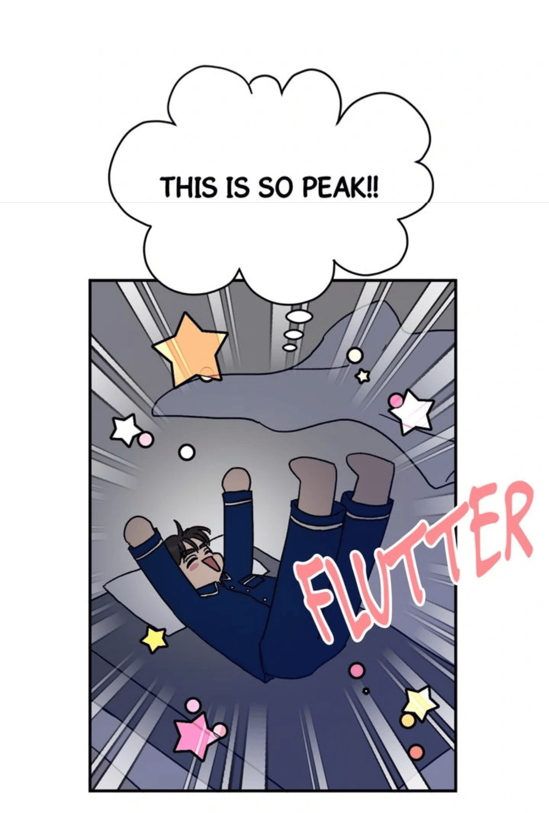
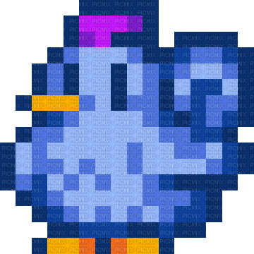

# Reykjavik Salvador 

*computer science and engineering @ uc merced*

 

### About Me 

Heyy! I'm Reykjavik, and I'm a 4th year CSE student at UC Merced graduating in December 2026. In terms of my favorite topics in computer science, I love networks and IoT!! But, I'm also big on environmental health and air quality.

 

 
